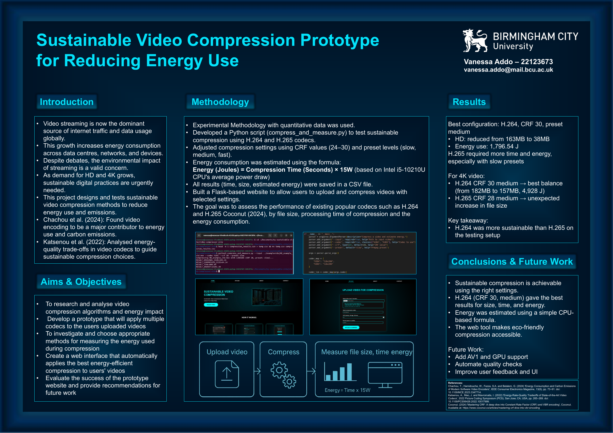

# Sustainable Video Compression Web App

This is a Flask-based web application that allows users to upload short videos (up to 3 minutes) and compress them using H.264 or H.265, with an estimated energy usage based on compression time.

It was created as part of a final-year dissertation on **sustainable video compression and green computing**.

---

## Features

- Upload videos up to **3 minutes** (`.mp4`, `.mkv`, `.avi`, `.mov`)
- Choose codec: **H.264 (libx264)** or **H.265 (libx265)**
- Configure **CRF** and **preset** for quality vs speed
- Compression handled by `ffmpeg`
- Energy usage estimated using a fixed **15W CPU power model**
- Results page shows:
  - Original size
  - Compressed size
  - Time taken
  - Estimated energy (joules)
- Download link for the compressed file
- Simple cleanup route to clear `uploads/` and `compressed/`

---

## Tech Stack

- **Backend:** Python, Flask
- **Frontend:** HTML, CSS
- **Templates:** Jinja2 (`templates/`)
- **Video tools:** `ffmpeg`, `ffprobe` (command line)

### Dissertation Poster

